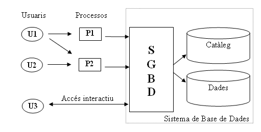

# **2.Concepte de Base de Dades**
Per a millorar els problemes que se'ns presentaven amb els fitxers tradicionals introduirem el concepte de Base de Dades.

2\.1 Definició

Hi ha moltes definicions de Bases de Dades. Intentarem donar una que no sigue massa pesada.

Una **Base de Dades** és un conjunt de dades relacionades entre elles, integrat en una única estructura global que és independent dels programes que la utilitzen i sense redundàncies innecessàries.

Comentem un poc aquesta definició. El primer comentari és sobre les dades. No intentarem agafar totes les dades del món, sinó únicament sobre les coses que volem estudiar, i d'elles únicament les dades interessants, per aconseguir el propòsit perseguit. Per tant, una Base de Dades té una font de la qual es deriven les dades i uns usuaris als quals interessen les dades.

Per la pròpia definició, la Base de Dades es podria crear i mantenir manualment (pensem en les fitxes tradicionals d'una biblioteca). Es podria crear i mantenir també per mig d'un grup de programes d'aplicació realitzats específicament per aquesta feina, però el més normal, i el que ens interessa a nosaltres és que açò es faça per mig d'un Sistema Gestor de Bases de Dades.

Un **Sistema Gestor de Bases de Dades** (**SGBD**; en anglès *DataBase Management System: DBMS*) és un conjunt de programes que permet als usuaris crear i mantenir Bases de Dades. Així la Base de Dades són les nostres dades (organitzades) i el SGBD serien productes com ACCESS, POSTGRESQL o ORACLE que ens permeten crear i mantenir aquesta Base de Dades.

Per la figura ja veiem que la Base de Dades s'organitza en dos grans blocs, un és el **catàleg** o **diccionari de dades**, on està l'estructura i tipus de les dades. En l'altre estan les pròpies dades. Per tant veiem que l'estructura de les dades va amb la pròpia Base de Dades.

Totes les peticions d'accés a les dades no es fan directament, sinó que es demanen al SGBD, que és qui s'encarrega d'accedir a elles. L'accés es pot fer per mig de processos (programes, formularis, ...) o bé de forma interactiva (per exemple amb consultes SQL). Alguns autors anomenen al conjunt de la Base de Dades i el SGBD com **Sistema de Base de Dades**.

2\.2 Comparació amb fitxers tradicionals

Una vegada hem vist la definició de Base de Dades i alguna de les seues característiques anem a comparar amb els fitxers tradicionals per veure els avantatges.

- Una Base de Dades és autodescriptiva, és a dir la definició de l'estructura, tipus de dades, etc. forma part de la pròpia B.D. (el **diccionari de dades**). En els fitxers tradicionals l'estructura d'aquestos havia d'anar en cada programa.
- Independència de les dades dels programes. És conseqüència de l'anterior. Així, en una B.D., la modificació de l'estructura (afegint algun camp o modificant-ne algun) no afecta als programes que puguen accedir a ella. Ja havíem vist que no era així en els fitxers tradicionals.
- No hi ha redundància, o molt poca. Potser convenient un poc de redundància per un millor rendiment, però aquesta pot ser controlada (per a evitar inconsistències, ...)
- Múltiples vistes d'usuari. Podríem pensar que al concentrar en una única B.D. totes les dades es perd la visió particular d'un usuari (que en fitxers tradicionals són el fitxers individuals de cadascun d'ells). Però no és així, ja que en les B.D. es poden definir vistes, que són la part de les dades que li interessen a un usuari determinat.
- Compartiment de les dades per part de molts usuaris, amb accés simultani sobre elles. Haurà d'haver en el software un control de concurrència, per assegurar que l'actualització simultània d'uns quants usuaris siga correcta.

Els inconvenients que suposa la utilització de B.D. són els següents:

- El Hardware i el software són més costosos.
- Necessitat de personal especialitzat.
- La implantació és més llarga i difícil, i per tant és una solució bona a mig i llarg termini.

És a dir, que si és una aplicació senzilla, potser siga convenient utilitzar fitxers tradicionals, però si és d'una certa envergadura o s'ha d'anar ampliant al llarg del temps, convé una B.D.

2\.3 Usuaris de la BD

Els múltiples usuaris que poden utilitzar la B.D. són de distints tipus. Anem a fer una classificació d'aquestos. Aquesta classificació agrupa dos grans blocs: els usuaris amb coneixements informàtics i els usuaris que no en tenen (o no tenen per què tenir-ne).

**A. Usuaris informàtics**.

**A.1 Dissenyadors**.

Encarregats de dissenyar la B.D.: triar el tipus d'informació necessària, organitzar-la en estructures adequades.

**A.2 Administradors**.

És l'encarregat de vetllar pel bon funcionament del sistema: administrar els usuaris i permisos, protegir la B.D. d'errades (fent còpies de seguretat, ..), optimitzar el sistema, etc. És a dir molta feina.

**A.3 Analistes i programadors**.

Estudien els requeriments dels usuaris finals per a fer programes, formularis, ... que possibiliten la feina d'aquestos.

**B. Usuaris finals**.

Són les persones que necessiten l'accés a la B.D. per a introduir dades, actualitzar-les, consultar-les, generar informes, ... Entre ells distingim:

**B.1 Habituals**.

També anomenats **paramètrics**, solen fer consultes i actualitzacions constants (sempre les mateixes). Normalment els analistes i programadors els faran els programes o formularis per a fer la seua feina.

**B.2 Esporàdics**.

Utilitzen la B.D. de tant en tant, i cada vegada per a obtenir una informació diferent. El més normal és que utilitzen un llenguatge de consulta de la B.D. avançat però senzill d'utilitzar.

Llicenciat sota la [Llicència Creative Commons Reconeixement NoComercial CompartirIgual 3.0](http://creativecommons.org/licenses/by-nc-sa/3.0/)
