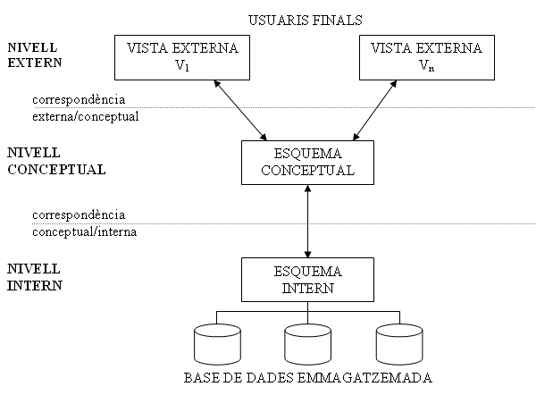
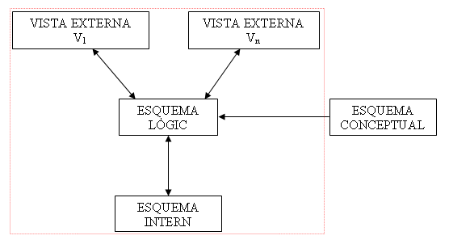

# 4. Arquitectura a 3 nivells

Per a estandarditzar l'arquitectura dels SGBD, el comitè _ANSI/X3/SPARC_ va
proposar una arquitectura a 3 nivells, per assegurar algunes de les
característiques que hem vist com a desitjables, en concret la de la separació
entre programes i dades, les múltiples vistes i la utilització d'un catàleg
per a la descripció de la B.D. Aquest són els 3 nivells:

  1. Al **NIVELL INTERN** o **FÍSIC** hi ha un **esquema intern** que descriu l'estructura física d'emmagatzematge de la B.D. S'utilitza un model físic, i descriu tots els detalls per al seu emmagatzematge (on estan els fitxers, quants, estratègies d'accés a les dades, ...). 
  

  2. Al **NIVELL CONCEPTUAL** o **LÒGIC** hi ha un **esquema conceptual** , que descriu l'estructura de tota la B.D. per al conjunt dels usuaris. Oculta els detalls de les estructures físiques d'emmagatzematge. S'utilitza un model de dades conceptual o d'implementació 
  

  3. Al **NIVELL EXTERN** o **DE VISTES** s'inclouen diversos **esquemes externs** o **vistes d'usuari**. Cada esquema extern descriu la part de la B.D. que interessa a un grup d'usuaris determinat, i oculta la resta de la B.D. S'utilitza també un model conceptual o d'implementació. 

Per tant els tres esquemes són distintes maneres de descriure les dades,
encara que aquestes només existeixen realment en el nivell físic. Però
l'esquema intern ha de ser totalment transparent als usuaris, i ells han de
"veure" el seu esquema extern. Qualsevol referència a aquest esquema s'haurà
de traduir, per part del SGBD, a referències a les dades oportunes de
l'esquema lògic. I posteriorment s'haurà de traduir en una sol·licitud a
l'esquema físic. Per exemple, suposem una vista on tenim el nom i l'edat dels
empleats. Una sol·licitud de tota la vista externa s'haurà de traduir en una
sol·licitud de les dades correctes de l'esquema lògic, el nom i la data de
naixement. I per la seua banda s'haurà de traduir en una sol·licitud a
l'esquema físic, on se sabran on estan exactament les dades, si hi ha índex
per fer més ràpid l'accés, ... Posteriorment quan ja estan les dades, s'hauran
de passar al nivell superior, i després de fer el càlcul oportú passar-les al
nivell extern.

El procés de transformar sol·licituds i resultats d'un nivell a un altre
s'anomena correspondència o transformació (_mapping_). Evidentment consumiran
temps, però facilitaran el que es pretenia:

  * **Independència lògica respecte a les dades** : es pot modificar l'esquema lògic sense haver de modificar els esquemes externs. Per exemple, en l'esquema lògic puc incorporar un camp per als empleats que siga la data d'ingrés en l'empresa. Això no afectarà per a res a la vista externa d'empleats i edats. 
  

  * **Independència física respecte a les dades** : es pot modificar l'esquema físic sense haver de modificar l'esquema lògic, i molt menys els esquemes externs. Així per exemple es pot afegir més espai per a la B.D. incorporant un nou fitxer on es guardaran les coses (Oracle), o s'inclou un nou índex per accedir més ràpidament a les dades per un determinat ordre. 

També hem de dir que no sempre els SGBD comercials compleixen estrictament
aquestos 3 nivells en la seua arquitectura. Sobretot en els més menuts, ja que
obligatòriament la correspondència entre els nivells tarda temps, i retarda
els resultats.

Anem a ampliar l'anterior arquitectura a tres nivells per incorporar tot el
procés que farem en la construcció d'una B.D.

On hem incorporat, fora de l'arquitectura a 3 nivells, és a dir fora del SGBD,
l'esquema conceptual, que seria la concepció de la B.D. en un model d'alt
nivell com el Model E/R. A partir d'ell realitzaríem l'esquema lògic (amb un
model d'implantació). Després ja es passaria a l'esquema intern, i també als
esquemes externs.

Llicenciat sota la  [Llicència Creative Commons Reconeixement NoComercial
CompartirIgual 3.0](http://creativecommons.org/licenses/by-nc-sa/3.0/)

